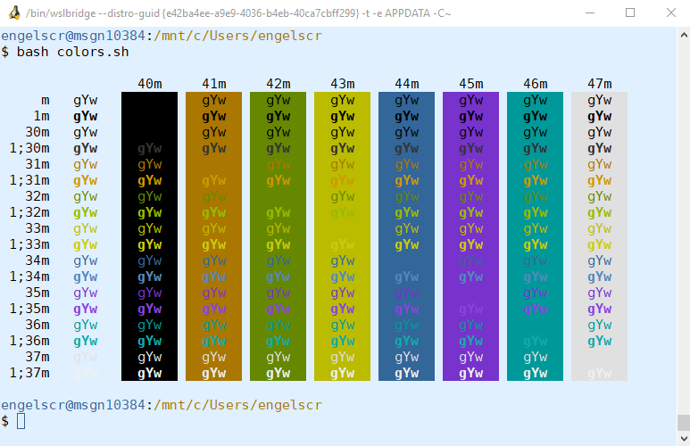

mintty-config
=============

This is Ralf S. Engelschall's configuration for
[MinTTY](https://mintty.github.io/)/[WSLTTY](https://github.com/mintty/wsltty),
the excellent terminal emulator for Windows. It provides both a useful
pre-configuration of MinTTY/WSLTTY features and the *bright blue/brown* theme
of Ralf S. Engelschall. 

Just copy the file [config](./config) to `%AppData%/mintty/config`
(MinTTY) or to `%AppData%/wsltty/config` (MinTTY/WSLTTY). Notice that under
Windows Subsystem for Linux (WSL) the `%AppData%` directory is reachable via `~/AppData/Roaming/`.

You can use the provided small Bash script [colors.sh](./colors.sh) to test-drive
your theme configuration.

